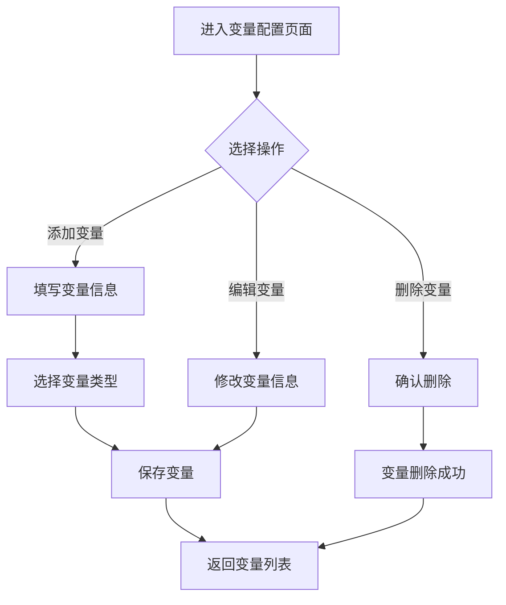
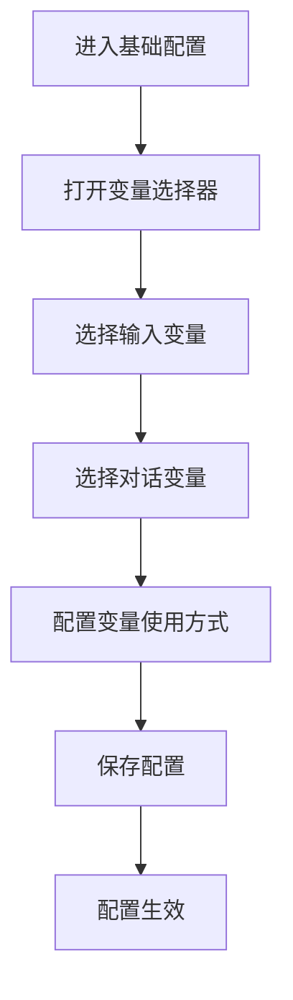
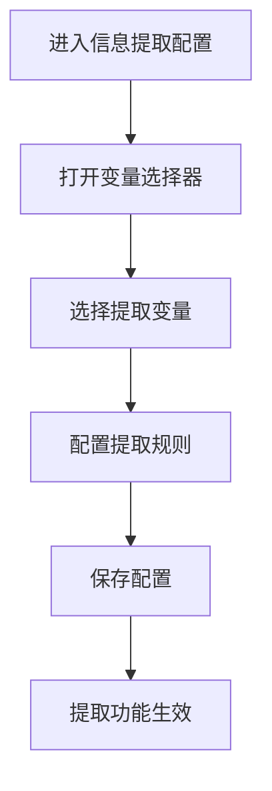

# 变量配置功能PRD文档

## 文档信息

| 项目 | 内容 |
|------|------|
| 文档名称 | 机器人变量配置功能PRD |
| 版本号 | v1.0 |
| 创建日期 | 2026-02-27 |
| 适用项目 | AI Voice Bot 智能语音机器人 |
| 文档类型 | 产品需求文档 |

---

## 一、产品概览

### 1.1 产品背景

随着AI语音机器人的应用场景不断扩展，需要更灵活、更精确的变量管理机制来满足不同业务场景的需求。当前系统需要清晰区分不同类型的变量，以优化变量的使用效率和管理流程。

### 1.2 产品目标

- 建立清晰的变量分类体系，区分输入变量、对话变量和提取变量
- 优化变量配置界面，提供直观的变量管理功能
- 确保变量在不同功能模块中的正确使用和隔离
- 提升系统的可维护性和扩展性

### 1.3 术语定义

| 术语 | 解释 |
|------|------|
| 输入变量 | 提前给大模型的变量，只使用一次，如外呼联系单信息 |
| 对话变量 | 随通话变化，多次使用的变量，如系统时间、通话状态等 |
| 提取变量 | 通话结束后提取的变量，仅用于信息提取功能 |
| ASR | 自动语音识别(Automatic Speech Recognition) |
| 大模型 | 指AI语言模型，如Gemini、GPT等 |
| 信息提取 | 从通话内容中提取结构化信息的功能 |

---

## 二、功能模块

### 2.1 变量类型管理

| 变量类型 | 定义 | 特点 | 适用场景 |
|---------|------|------|----------|
| **输入变量** | 提前给大模型的变量，只使用一次 | 一次性使用，初始化时注入 | 外呼联系单信息（姓名、公司、电话）、ASR提取的性别 |
| **对话变量** | 随通话变化，多次使用的变量 | 动态更新，可在对话中多次使用 | 系统时间、通话时间、通话状态、对话中提取的变量 |
| **提取变量** | 通话结束后提取的变量 | 仅用于信息提取功能 | 客户意图、预约时间、问题类型等 |

### 2.2 功能模块划分

1. **变量配置模块**
   - 变量类型管理
   - 变量添加/编辑/删除
   - 变量分类配置

2. **基础配置模块**
   - 变量选择功能（仅输入变量和对话变量）
   - 变量使用配置

3. **信息提取模块**
   - 提取变量选择功能
   - 提取规则配置

4. **调试模块**
   - 变量监视功能
   - 变量值实时更新

---

## 三、页面详情

### 3.1 变量配置页面

| 页面名称 | 模块名称 | 功能描述 | 操作流程 |
|---------|---------|---------|----------|
| 变量配置页 | 变量列表 | 显示所有变量及其类型 | 进入变量配置页面 → 查看变量列表 |
| 变量配置页 | 变量添加 | 添加新变量并指定类型 | 点击"添加变量" → 填写变量信息 → 选择变量类型 → 保存 |
| 变量配置页 | 变量编辑 | 修改现有变量的信息 | 选择变量 → 点击"编辑" → 修改信息 → 保存 |
| 变量配置页 | 变量删除 | 删除不需要的变量 | 选择变量 → 点击"删除" → 确认删除 |

### 3.2 基础配置页面

| 页面名称 | 模块名称 | 功能描述 | 操作流程 |
|---------|---------|---------|----------|
| 基础配置页 | 变量选择器 | 选择需要使用的输入变量和对话变量 | 进入基础配置 → 打开变量选择器 → 选择变量 → 确认 |
| 基础配置页 | 变量使用配置 | 配置变量在对话中的使用方式 | 选择变量 → 配置使用方式 → 保存 |

### 3.3 信息提取配置页面

| 页面名称 | 模块名称 | 功能描述 | 操作流程 |
|---------|---------|---------|----------|
| 信息提取配置页 | 提取变量选择 | 选择需要提取的变量 | 进入信息提取配置 → 打开变量选择器 → 选择提取变量 → 确认 |
| 信息提取配置页 | 提取规则配置 | 配置变量的提取规则 | 选择变量 → 配置提取规则 → 保存 |

### 3.4 调试页面

| 页面名称 | 模块名称 | 功能描述 | 操作流程 |
|---------|---------|---------|----------|
| 调试页面 | 变量监视器 | 实时显示变量值和变化 | 进入调试页面 → 观察变量监视器 → 进行对话测试 → 查看变量变化 |
| 调试页面 | 变量编辑 | 临时修改变量值进行测试 | 在变量监视器中双击变量 → 修改值 → 保存 → 测试效果 |

---

## 四、核心流程

### 4.1 变量配置流程



### 4.2 变量使用流程



### 4.3 信息提取配置流程



---

## 五、数据结构

### 5.1 变量数据结构

```typescript
interface BotVariable {
  id: string;           // 变量唯一标识
  name: string;         // 变量名称
  type: 'TEXT' | 'NUMBER' | 'DATE' | 'DATETIME' | 'TIME' | 'BOOLEAN'; // 变量类型
  description?: string; // 变量描述
  isSystem: boolean;    // 是否系统变量
  category: 'INPUT' | 'CONVERSATION' | 'EXTRACTION'; // 变量分类
  defaultValue?: any;   // 默认值
  source?: string;      // 变量来源（如：ASR、联系单等）
}
```

### 5.2 变量使用配置

```typescript
interface VariableUsageConfig {
  variableId: string;   // 变量ID
  usageType: 'INPUT' | 'OUTPUT' | 'CONDITION'; // 使用类型
  position: string;     // 使用位置
  config: any;         // 具体配置
}
```

### 5.3 提取规则配置

```typescript
interface ExtractionRule {
  id: string;           // 规则ID
  variableId: string;   // 目标变量ID
  pattern: string;      // 提取模式（正则表达式或自然语言描述）
  confidence: number;   // 置信度阈值
  fallbackValue?: any;  //  fallback值
}
```

---

## 六、界面设计

### 6.1 设计风格

- **主色调**：蓝色系 (#10b981 - 主色，#3b82f6 - 辅助色)
- **按钮风格**：圆角按钮，hover效果
- **字体**：系统默认字体，14px 主文本，12px 辅助文本
- **布局**：卡片式布局，清晰的视觉层次
- **图标**：Lucide React 图标库

### 6.2 页面设计

#### 6.2.1 变量配置页面

- **布局**：左侧导航栏，右侧内容区
- **内容区**：
  - 顶部：页面标题、添加变量按钮
  - 中部：变量列表（表格形式）
  - 每行包含：变量名称、类型、分类、描述、操作按钮
  - 变量类型用不同颜色标签区分

#### 6.2.2 变量选择器

- **弹窗形式**：模态对话框
- **布局**：
  - 顶部：标题、关闭按钮
  - 中部：变量分类标签页（输入变量、对话变量 / 提取变量）
  - 每个标签页内：变量列表，带复选框
  - 底部：确认、取消按钮

#### 6.2.3 调试页面变量监视器

- **布局**：右侧面板
- **分类**：输入变量、对话变量、提取变量三个部分
- **每个变量**：
  - 变量名称
  - 变量类型（颜色标签）
  - 变量值（可编辑）
  - 变化状态指示

---

## 七、功能需求

### 7.1 核心功能

1. **变量分类管理**
   - 支持三种变量类型的创建和管理
   - 变量类型之间的明确区分

2. **变量配置**
   - 变量的添加、编辑、删除
   - 变量属性的完整配置

3. **变量选择**
   - 基础配置中只能选择输入变量和对话变量
   - 信息提取功能中只能选择提取变量

4. **变量监视**
   - 实时显示变量值
   - 支持变量值的临时修改

5. **变量使用**
   - 变量在对话中的正确使用
   - 变量值的动态更新

### 7.2 非功能需求

1. **性能**：变量操作响应时间 < 500ms
2. **可用性**：界面直观易用，操作流程清晰
3. **兼容性**：支持主流浏览器
4. **可扩展性**：支持未来新变量类型的添加

---

## 八、测试要点

### 8.1 功能测试

| 测试项 | 测试内容 | 预期结果 |
|-------|---------|----------|
| 变量创建 | 创建不同类型的变量 | 变量创建成功，类型正确 |
| 变量编辑 | 修改变量属性 | 变量属性更新成功 |
| 变量删除 | 删除不需要的变量 | 变量删除成功，相关配置更新 |
| 变量选择 | 在基础配置中选择变量 | 只能选择输入变量和对话变量 |
| 提取变量选择 | 在信息提取中选择变量 | 只能选择提取变量 |
| 变量监视 | 观察变量值变化 | 变量值实时更新，变化状态正确 |
| 变量使用 | 在对话中使用变量 | 变量值正确替换，多次使用有效 |

### 8.2 边界测试

| 测试项 | 测试内容 | 预期结果 |
|-------|---------|----------|
| 变量名称重复 | 创建同名变量 | 系统提示错误，不允许创建 |
| 变量类型错误 | 选择错误的变量类型 | 系统提示错误，不允许保存 |
| 变量使用限制 | 尝试在信息提取中使用输入变量 | 系统限制选择，只显示提取变量 |
| 变量值为空 | 变量值为空时的处理 | 系统使用默认值或空值处理 |

### 8.3 异常测试

| 测试项 | 测试内容 | 预期结果 |
|-------|---------|----------|
| 网络中断 | 网络中断时的变量操作 | 操作失败，显示错误提示 |
| 权限不足 | 无权限用户操作变量 | 系统拒绝操作，显示权限提示 |
| 数据冲突 | 多用户同时编辑变量 | 系统提示冲突，要求刷新 |

---

## 九、实施计划

### 9.1 开发阶段

1. **第一阶段**：变量数据结构设计和后端API开发
2. **第二阶段**：变量配置界面开发
3. **第三阶段**：变量选择器和使用配置开发
4. **第四阶段**：调试页面变量监视器开发
5. **第五阶段**：信息提取配置开发

### 9.2 测试阶段

1. **单元测试**：测试各功能模块的独立功能
2. **集成测试**：测试模块间的协作
3. **系统测试**：测试完整的变量配置和使用流程
4. **用户测试**：邀请用户进行功能测试

### 9.3 上线计划

1. **灰度发布**：先在测试环境部署
2. **内部测试**：内部团队使用测试
3. **正式发布**：全量发布到生产环境
4. **监控**：上线后监控系统运行状态

---

## 十、风险评估

| 风险项 | 风险描述 | 应对措施 |
|-------|---------|----------|
| 变量类型混淆 | 用户可能混淆不同类型变量的使用场景 | 提供清晰的文档和界面提示，加强用户培训 |
| 变量依赖问题 | 变量之间可能存在依赖关系 | 建立变量依赖管理机制，提供依赖检查 |
| 性能影响 | 大量变量可能影响系统性能 | 优化变量存储和访问机制，限制变量数量 |
| 向后兼容性 | 变量配置变更可能影响现有功能 | 提供配置迁移工具，确保平滑升级 |

---

**文档结束**
